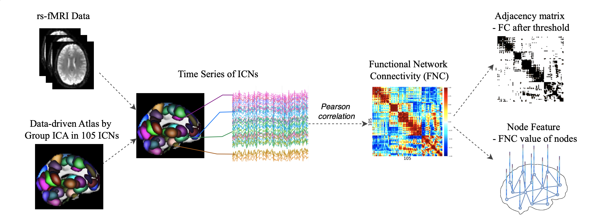
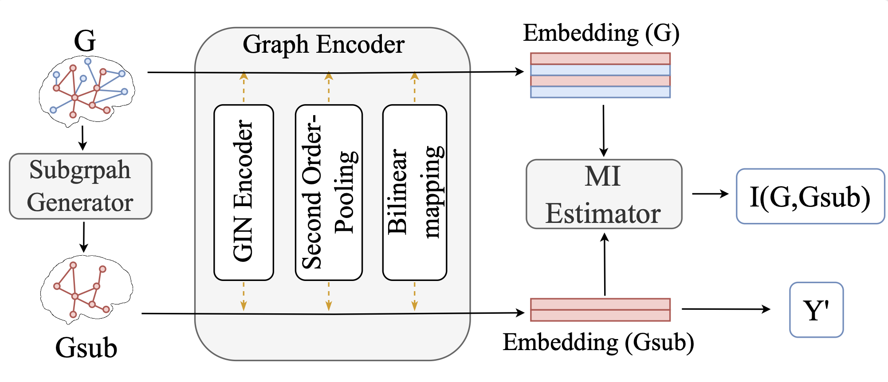
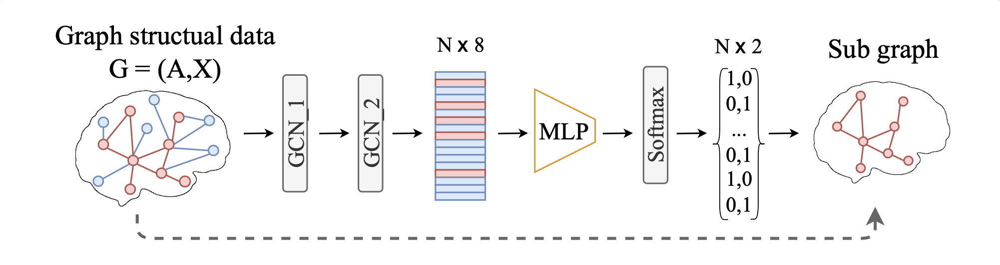
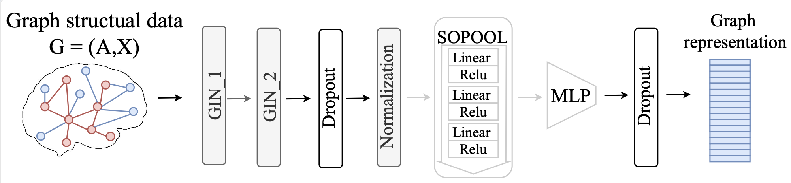
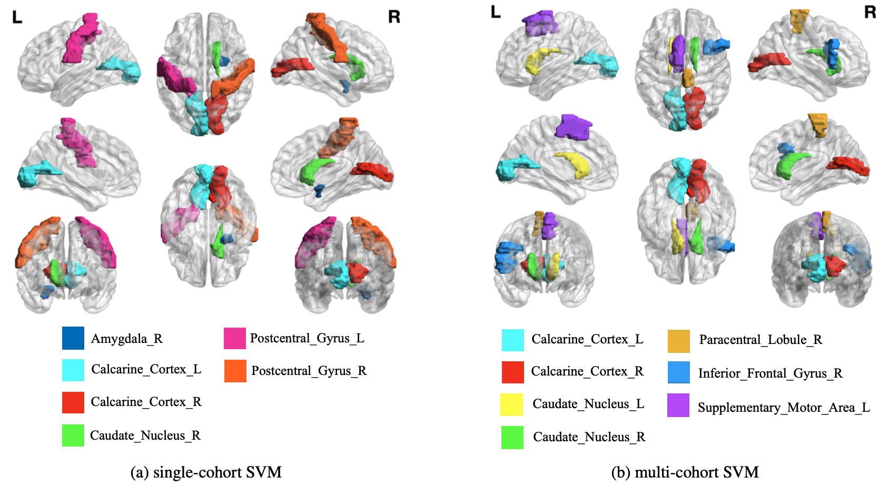
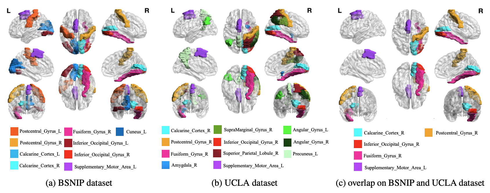

# BrainIB++

## Leveraging Graph Neural Networks and Information Bottleneck for Functional Brain Biomarkers in Schizophrenia

This is the BrianIB++ demo for the BSNIP, UCLA and COBRE dataset, BrianIB++ is also known as BrainIB V2.
This work has been accepted by Biomedical Signal Processing and Control. 
Arkiv: https://www.arxiv.org/abs/2510.03004

This README.md is for all readers.
 
### Contents
- [Overall Methods](#getting-started)
  - [Data Preprocessing](#data-preprocessing)
  - [The Architecture of model](#the-architecture-of-model)
- [Implementation](#implementation)
- [Results](#results)
- [Interpretable analysis](#interpretable-analysis)
- [Getting Started](#getting-started)
  - [Configuration requirements](#configuration-requirements)
  - [Step by step](#step-by-step)
- [File Directory Description](#file-directory-description)

### Overall Methods

#### Data Preprocessing
 In this study, two datasets are used: the public dataset acquired from UCLA Consortium for Neuropsychiatric Phenomics(UCLA)(https://exhibits.stanford.edu/data/catalog/mg599hw5271), and
 the dataset from the Tri-Institutional Georgia State University/Georgia Institute of Technology/Emory University Center for Translational Research in Neuroimaging and Data Science (TReNDS)\footnote(https://trendscenter.org/data/), US (BSNIP)(https://github.com/TianzhengHU/BrainIB_node). 

****

**Figure 1 data preprocessing** 
The resting-state fMRI raw data are preprocessed and then parcellated into regions of interest (ROIs) according to the Group ICA atlas and the map to the automated anatomical labeling (AAL) atlas. The functional connectivity (FC) matrices are calculated using Pearson correlation between ROIs. From the FC we construct the brain functional graph G = {A, X}, where A is the graph adjacency matrix characterizing the graph structure and X is the node feature matrix. Specifically, A is a binarized FC matrix, where only the top 20-percentile absolute values of the correlations of the matrix are transformed into ones, while the rest are transformed into zeros.  For node feature $X$, $X_{k}$ for node $k$ can be defined as $X_{k}=\left [ \rho_{k1},\dots, \rho_{kn}\right ] ^{\text{T}}$ , where $\rho_{kl}$ is the Pearson’s correlation coefficient for node $k$ and node $l$. Note that, we only consider functional connectivity values as node features, which is common in brain network analysis [4]. Finally, the functional graph is fed to BrainIB for psychiatric classification.


#### The Architecture of model

<p align="center">
  <figure>
    
  </figure>
</p>

**Figure 2 data preprocessing** BrainIB+ including a Subgraph Generator, a Graph Encoder, and a Mutual Information Estimator

<p align="center">
  <figure>
    
  </figure>
</p>

**Figure 3 subgraph generator** Given the input graph structure data G, the subgraph is generated along with the node assignment S, indicating whether a specific node belongs to $G_{sub}$ or $\overline{G_{sub}}$. 
Softmax to the output of MLP to ensure the nodes are either in or out of the subgraph followed by GCN layers. The MLP utilized in this context is a two-layer fully connected neural network. We employed it to continuously reduce the dimensionality of nodes from 8 to 2.
S is a matrix in shape $N\times 2$, where N is the number of nodes. When S is well-learned, the assignment of nodes is supposed to saturate to 0/1. 
The representation of $G_{sub}$ that used to predict the graph label can be obtained by taking the first row of $S^TX^l$.


<p align="center">
  <figure>
    
  </figure>
</p>

**Figure 4 graph encoder** The object of the graph encoder is to encode the graph structure data G = (X, A) as vertical embedding. It is applied on both the whole graph data G and the subgraph data $G_{sub}$ generated by the Subgraph Generator.
After two layers of GIN, we obtain the representation H of the original nodes feature matrix X. 
We add a second-order pooling (SOPOOL) on the H followed by dropout and normalization operation, defined as: 
```math
g_n = \mathrm{flatten} \left( \mathrm{SOPOOL}_{bi-linear} \left(GIN (A, X) \right) \right)
```

### Implementation

The graph IB objective includes two mutual information terms:

```math
{\mathrm{min}} I(G_{sub}, G) - \beta I (G_{sub},Y)
```

Minimizing $-I (G_{sub}, Y)$ encourages $G_{sub}$ is most predictable to graph label Y. Maximizing the $I(G_{sub}, G)$ encourages the subgraph sampling keep as much information from the original graph as possible.


### Results

<table border="1">
  <caption>TABLE I: Experiment performance of all baseline models and BrainIB++ model on the single- cohort datasets, which means training and testing on the same dataset. </caption>
  <thead>
    <tr>
      <th rowspan="2">Single-cohort</th>
      <th colspan="5">Traditional Model</th>
    </tr>
    <tr>
      <th>SVM</th>
      <th>KNN</th>
      <th>Decision Tree</th>
      <th>AdaBoost</th>
    </tr>
  </thead>
  <tbody>
    <tr>
      <td>BSNIP</td>
      <td>0.611</td>
      <td>0.651</td>
      <td>0.568</td>
      <td>0.625</td>
    </tr>
    <tr>
      <td>UCLA</td>
      <td>0.667</td>
      <td>0.664</td>
      <td>0.607</td>
      <td>0.727</td>
    </tr>
    <tr>
      <td>COBRE</td>
      <td>0.750</td>
      <td>0.731</td>
      <td>0.712</td>
      <td>0.625</td>
    </tr>
  </tbody>
</table>

<br/>

<table border="1">
  <thead>
    <tr>
      <th rowspan="2">Single-cohort</th>
      <th colspan="4">Graph Model</th>
      <th colspan="2">Graph IB Model</th>
    </tr>
    <tr>
      <th>GCN</th>
      <th>GIN</th>
      <th>GAT</th>
      <th>Graph Transformer</th>
      <th>BrainIB</th>
      <th>BrainIB++</th>
    </tr>
  </thead>
  <tbody>
    <tr>
      <td>BSNIP</td>
      <td>0.743</td>
      <td>0.733</td>
      <td>0.725</td>
      <td>0.711</td>
      <td>0.722</td>
      <td><b>0.748</b></td>
    </tr>
    <tr>
      <td>UCLA</td>
      <td>0.737</td>
      <td>0.769</td>
      <td>0.762</td>
      <td>0.771</td>
      <td>0.770</td>
      <td><b>0.783</b></td>
    </tr>
    <tr>
      <td>COBRE</td>
      <td>0.759</td>
      <td>0.773</td>
      <td>0.761</td>
      <td>0.823</td>
      <td>0.833</td>
      <td><b>0.847</b></td>
    </tr>
  </tbody>
</table>

<br>

<table border="1">
  <caption>TABLE II: Experiment performance of all baseline models and BrainIB++ model on the multi-cohort datasets, which  means training and testing on different datasets. </caption>
 <thead>
    <tr>
      <th rowspan="2">Multi-cohort</th>
      <th colspan="4">Traditional Model</th>
    </tr>
    <tr>
      <th>SVM</th>
      <th>KNN</th>
      <th>Decision Tree</th>
      <th>AdaBoost</th>
    </tr>
  </thead>
  <tbody>
    <tr>
      <td>BSNIP → UCLA</td>
      <td>0.697</td>
      <td>0.667</td>
      <td>0.424</td>
      <td>0.455</td>
    </tr>
    <tr>
      <td>BSNIP → COBRE</td>
      <td>0.250</td>
      <td>0.673</td>
      <td>0.610</td>
      <td>0.438</td>
    </tr>
  </tbody>
</table>

<br/>

<table border="1">
  <thead>
    <tr>
      <th rowspan="2">Multi-cohort</th>
      <th colspan="4">Graph Model</th>
      <th colspan="2">Graph IB Model</th>
    </tr>
    <tr>
      <th>GCN</th>
      <th>GIN</th>
      <th>GAT</th>
      <th>Graph Transformer</th>
      <th>BrainIB</th>
      <th>BrainIB++</th>
    </tr>
  </thead>
  <tbody>
    <tr>
      <td>BSNIP → UCLA</td>
      <td>0.565</td>
      <td>0.571</td>
      <td>0.594</td>
      <td>0.568</td>
      <td>0.693</td>
      <td><b>0.709</b></td>
    </tr>
    <tr>
      <td>BSNIP → COBRE</td>
      <td>0.584</td>
      <td>0.632</td>
      <td>0.621</td>
      <td>0.646</td>
      <td>0.667</td>
      <td><b>0.681</b></td>
    </tr>
  </tbody>
</table>


### Interpretable analysis

<p align="center">
  <figure>
    
  </figure>
</p>

**Figure 5 interpretable analysis result** SVM training on the single-cohort dataset and multi-cohort dataset, result in 30\% and 35\% overlap cross dataset respectively. The overlap of BSNIP and UCLA is focused on Amygdala\_R, Calcarine\_L, Calcarine\_R, Postcentral\_L, Postcentral\_R, and Caudate\_R. The overlap brain regions of multi-cohort training includes Frontal\_Inf\_Oper\_R, Supp\_Motor\_Area\_L, Paracentral\_Lobule\_R, Caudate\_L) and Caudate\_R,  Calcarine\_L, Calcarine\_R

<p align="center">
  <figure>
    
  </figure>
</p>

**Figure 6 interpretable analysis result** The BrainIB++ model demonstrated 40\% overlap in distinct node preferences across both the BSNIP and UCLA datasets during multi-cohort training. Fig.(a) and Fig.(b) illustrate the nodes with the highest probabilities selected by the well-trained BrainIB++ subgraph generator for the BSNIP dataset and the UCLA dataset, respectively. Fig.(c) displays the five common nodes identified in both (a) and (b), including Supp\_Motor\_Area\_L, Calcarine\_R, Occipital\_Inf\_R, Fusiform\_R, Postcentral\_R. Supp\_Motor\_Area\_L and Calcarine\_R appeared more than once  within the overlapping nodes.

### Getting Started

Please ensure that the device has a working environment。

#### Configuration requirements

1. Activate your environment
2. Install packages
```sh
pip install torch==1.9.0 torchvision==0.10.0 torchaudio==0.9.0
pip install torch-scatter==2.1.1 torch-sparse==0.6.12 torch-geometric==2.0.3
pip install -r requirements.txt --no-deps
```

#### **Step by step**

1. Clone the repo
```sh
git clone git@github.com:TianzhengHU/BrainIB_coding.git
```

2. Download the example dataset from Google Drive.
The datasets used in this project are public avaliable. To facilitate testing, we make the preprocessed dataset publicly available on Google drive.
Please download dataset files: **UCLA.mat** and **BSNIP.mat** from link:
```
 https://drive.google.com/drive/folders/1ca9-nxsldpN3Cam_bGX6odce1VlOt96J?usp=share_link
```
Put them under the "real_data" folder.


3. Run the code
```sh
python SGSIB_main.py
```


### File Directory Description

```
BrainIB_GIB 
├── /SGSIB/
│  ├── /model/
│  ├── sub_graph_generator.py
│  ├── sub_node_generator.py
│  └── utils.py
├── /baseline_data/
│  ├── /data/
│  └── baseline_main.py
├── /real_data/
│  ├── /Utils_preprocessing/
│  │  ├── BrainNet_index_map.xlsx
│  │  ├── BSNIP_new_id.xlsx
│  │  ├── ICNs_v2.xlsx
│  │  ├── closest_map_points.xlsx
│  │  ├── UCLA_preprocessing.py
│  │  └── Map_groupICA_and_BrainNet_map.py
│  ├── analysis_data.py
│  └── create_dataset.txt
├── Graph_network_main.py
├── SGSIB_main.py
├── Traditional_main.py
├── Visualization.py
├── requirements.txt
└── README.md

```
